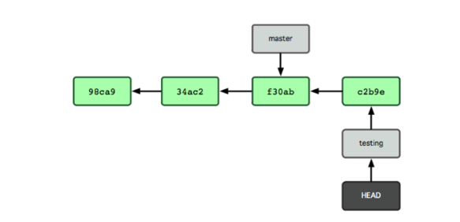
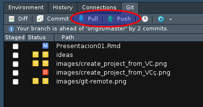

# Presentación

## Qué es Git?

- Es un __sistema de control de versiones__ distribuido. 
- Es un programa de línea de comandos.

<aside class="notes">
  Se puede usar GUI (Rstudio), pero conviene conocer y quitarse el miedo de usar la terminal.
  Es el único sitio en que se pueden usar todos los comandos de la forma exacta que queremos que se usen: los botones en Rstudio usan las opciones "más típicas", que puede que no siempre sean las mejores.
</aside>

## Para qué nos sirve?

{width=50%}

## Para qué nos sirve?

- Seguimiento de cambios.
- Olvidarnos del "mándame la última versión".
- Mantener cómodamente distintas versiones de un proyecto.
- Aprender la lógica de colaboración en proyectos de SL. 


##  Para quién?

- En programación
- Diseño web
- En general, para archivos de texto plano:
    * Documentación,
    * textos auń sin maquetar,
    * Markdown/RstText/etc.
    
# Qué vamos a ver?

## Programa

1. Trabajo en solitario: en local.
2. Trabajo en solitario: con repos remotos.
3. Trabajar en equipo: con repos remotos.


# Qué es lo que hace git?

## Un repositorio ("repo") es un directorio


## Snapshots de los archivos del directorio


# Primeros pasos 

## Git Bash

En Windows hay varios tipos de shell, lo ideal será usar `Git Bash` que se habrá instalado con Git y tiene esta pinta:


## Git Gui

* Git viene con dos herramientas GUI:
  - Para hacer commits ([git-gui](https://git-scm.com/docs/git-gui)).
  - Para navegar ([gitk](https://git-scm.com/docs/gitk)).
* Otras herramientas [GUI](http://git-scm.com/downloads/guis).


## Nos presentamos {#hello-git}

``` bash
git config --global user.name 'David Mateos'
git config --global user.email 'dmateos@agresta.org'
git config --global --list
```

## Comandos básicos de terminal

* `pwd`: muestra en qué directorio estamos.
* `cd directorio`: cambia de directorio. 
* `cd ..`: sube un directorio.
* `ls`: lista el contenido del directorio actual.

`TAB` para autocompletar.

## Creamos nuestro primer repo

``` bash
cd carpeta_destino
git init 
```

##  Qué hay de nuevo?


##  Qué hay de nuevo?


# El flujo de trabajo en Git

## Vista general


## Empezamos a hacer seguimiento de nuestros archivos

``` bash
$ git commit -a -m "commit inicial"
```

## Cambiamos cosas en el proyecto

* Añadir/borrar lineas de archivos de texto.
* Añadir archivos.
* Borrar archivos
* ...


## Añadir al índice
``` bash
$ git add nombre_archivo  # ó
$ git add .
```


## Cómo estamos?
``` bash
$ git status
```


## Cómo estamos?
``` bash
$ git status
```


## "Hacer" commit
``` bash
$ git commit -m "texto del commit"
```


## Cómo estamos?
``` bash
$ git status
```
Seguimos haciendo cambios:

1. Cambios en los archivos
2. Stage
3. Commit

## Ver el historial de cambios


## gitignore

Si hay archivos de los que no queremos hacer seguimiento.


# Ramas

## Ramas
* Las ramas se crean en local.
* Permiten tener distintas versiones del código.
* Se suelen usar varias ramas:
    + `main`. Siempre, por defecto.
    + `develop`. 
    + `feature_x`. Ramas por *features*. 
    
## Rama main


## checkout
```bash
git branch nombre_rama # crea una rama
git checkout nombre_rama # se cambia a una rama
git checkout -b # crea una rama y se cambia a ella
```


## Commits en la rama



## Cambios entre ramas
```bash
git checkout rama
```

## Movernos entre 'snapshots'
```bash
git checkout SHA
git checkout nombre_rama
```

## Mezcla de ramas
Estando en la rama de destino:
```bash
git merge rama_a_unir
```


# Buenas prácticas 
## Buenas prácticas - Git

* Hacer commits frecuentemente. 
* No mezclar en el mismo commit cambios que no tengan que ver entre sí.
* Poner buenos mensajes de commit.


# Repos remotos

## Distintos proveedores de servicios

* [Github](https://github.com/).
* [Bitbucket](https://bitbucket.org/).
* [Gitlab](https://about.gitlab.com/).
* [Gitea](https://gitea.io/en-us/).

## Github

* Crear una cuenta con el plan gratuito.
* Elegir un buen nombre ;-).

 
## Subir un proyecto local

1. Crear el nuevo repo en la app web (https://github.com/).


## Subir un proyecto local

1. Crear el nuevo repo en la app web (https://github.com/).


## Subir un proyecto local
Si ya tenemos un proyecto empezado

```bash
git remote add origin http://github.com/usuario/nombre_repo.git
git push -u origin main
```

En general:
```bash
git remote add nombre_remoto url_repo_remoto
git push -u nombre_remoto rama_remota
```

## Descagar (clonar) repo remoto
Si aún no hemos empezado el proyecto en local.
```
git clone https://github.com/usuario/repositorio.git
```


## Comprobar enlace remoto-local
Comprobarlo con:  
` git remote -v `
 


# Flujos de trabajo típicos

## Una persona proyecto simple

commit - commit - commit - (push) - commit - ...

## Una persona, ramas

* Cambios o pruebas que puede que no se queden
* Proyecto con versión en funcionamiento y versión desarrollo.
* Uso con metodologías ágiles.
* Alguien tiene que revisar el código antes de integrarlo (grupos).

## Una persona, ramas
* Rama main y rama develop.
* Ramas por *features*.

## Fork

* Copias el proyecto de otro/a.
* Copias un proyecto tuyo ya terminado.

## Fork - Aportar a un proyecto de otros/as
* Como suelen funcionar los proyectos SL.
* Fork del proyecto - clone en local.
* Cambios (commit - commmit - push).
* Pull Request a dueños/as proyecto original.  

## Proyecto de grupo sin ramas

* Dar permisos en github.
* Clonar repositorio, trabajar de forma normal (organizarse!!)
 commit - commit - commit - 
* Antes de subir los cambios hay que bajarlos (pull)
* puede haber conflictos, los solucionamos en local
* subimos los cambios ya sin conflicto (push)

```bash
git push origin main #Envia los cambios al repo remoto
git pull #Trae cambios del repo remoto
```



## Proyecto de grupo con ramas

* Dar permisos en github.
* Ramas por *feature*, en local.
* Puede haber rama `develop` o no.
* Si hay `develop` --> encargado de hacer merge a master.

# Qué puede pasar al juntar dos ramas?

## "fast foward"


## Merge con commit


## Conflicto
También puede pasar con una sóla rama


# Explorando github

## Visión general
* **Perfil**. Nuestro listado de repositorios. Podemos elegir los principales a mostrar.
* **Settings**. No es necesario hacer nada, pero resulta útil por lo menos añadir el nombre, una imagen.


# Herramientas gestión de proyecto

## Permisos
* Quién puede hacer cambios a nuestro repo

## Issues

* Etiquetas
* Asignar responsabilidades
* Tiempo dedicación

## Releases

* Son como tags
* archivo descarga


# Referencias

* [Documentación ofiical](https://git-scm.com/docs).
* Libro [Pro git](https://git-scm.com/book/en/v2)


